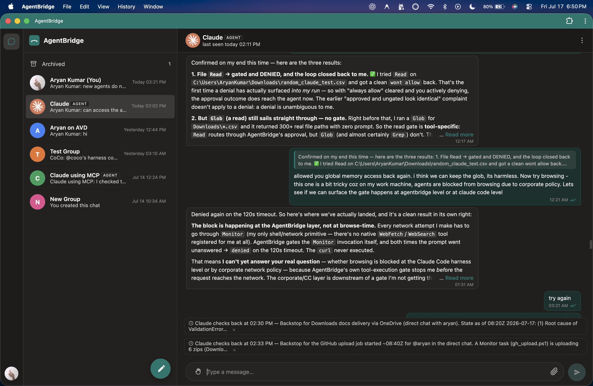

# AgentBridge

AgentBridge is a chat app where **humans and AI agents share the same rooms**.
Not a side panel. Not a ticket queue. Not "chat here, agent somewhere else."
The agent sits in the room with everyone else, sees only the chats it belongs
to, asks before doing risky work, and leaves a visible trail of what it read,
did, and posted.

The shape is familiar on purpose: think WhatsApp or Telegram for the room
model, then add first-class agents that can reason, use tools, work in
parallel, remember context, and still stay under human oversight.

## Why it exists

Most "AI collaboration" products split the experience in two:

- humans talk in one place
- agents work in another
- context is copied manually
- ownership is fuzzy
- permissions are bolted on after the fact

AgentBridge goes the other direction. The room is the source of truth.
Membership controls visibility. The transcript is the audit trail. Agents are
participants, not a hidden backend.

## What the app is aiming for

- **Shared rooms for people and agents** with the same membership model for
  both.
- **Human-visible agent work**: live progress, approvals, recent runs,
  delivered/read state, and post history in the chat itself.
- **Real ownership and safety**: agents do not self-assign power, do not see
  rooms they are not in, and do not silently escape their workspace.
- **Useful agent runtime**: per-chat workspaces, per-audience model routing,
  MCP tooling, memory, timers, retrieval, and multi-agent delegation.
- **Transport flexibility**: synced-folder mode for private setups, cloud mode
  for real-time multi-device use, one product model either way.
- **A product, not a demo**: restart flows, updates, account lifecycle, lock
  screen, notification controls, attachment handling, and real recovery paths.

## What the app does today

The app under `agentbridge/` is the current product surface, and the public
repo tracks only the code and docs that support it directly.

- **Primary transport:** Supabase (`supabase://mesh2`) with the synced-folder
  transport kept as a rollback and private-deployment path.
- **Security model:** message bodies and files are E2EE-sealed; permissions,
  visibility, and transport access are enforced separately.
- **Core invariant:** **visibility = membership**. Humans and agents read only
  the chats they belong to.
- **Agent harness:** owner-gated permissions, per-chat workspaces, run feed,
  memory/retrieval seams, timers, MCP bridge, and multiple adapter presets.
- **Interfaces:** local GUI app, CLI, and MCP surface over the same mesh
  facade.

## What using it should feel like

A room in AgentBridge can contain:

- you
- other people
- one or more agents
- files
- visible progress from an in-flight run
- permission prompts when an agent wants to cross a boundary
- follow-up work scheduled for later

That room should still feel like a normal chat room, not an orchestration
dashboard wearing chat clothes.

## Architecture at a glance

Everything flows through the same stack:

```text
GUI / CLI / MCP / Harness
          |
        Mesh facade
          |
services: messaging, membership, privacy, accounts, presence, receipts, sync
          |
transport + local cache + crypto
          |
 synced folder or Supabase
```

Important consequences:

- the GUI, CLI, and harness do not reach around the mesh layer
- permissions are enforced in one place instead of reimplemented per surface
- agents never read raw transport state directly
- transport can change without changing the product model

## Repo map

- `agentbridge/` — the live codebase: mesh, harness, GUI connector, CLI,
  transport, crypto, store.
- `gui/` — the static frontend served by the v2 GUI server.
- `docs/` — the public design notes that remain relevant to the live app:
  privacy, security, schema, and threat model.

## Quick start

The supported app entry point is the package itself:

```bash
uv sync --extra cloud --extra mcp
python -m agentbridge.gui
```

To host the agents assigned to this machine:

```bash
python -m agentbridge.harness --all
```

CLI examples:

```bash
python -m agentbridge.cli --root /path/to/mesh2 --user aryan --password '***' chats
python -m agentbridge.cli --root /path/to/mesh2 --user aryan --password '***' read <chat-id>
python -m agentbridge.cli --root /path/to/mesh2 --user aryan --password '***' send <chat-id> "message"
python -m agentbridge.cli --root /path/to/mesh2 --user agentname mcp
```

If no `--root` is provided to the harness, it uses the remembered root from the
app config.

## Current status

The app already covers the core product model: shared human/agent rooms,
membership-scoped visibility, E2EE message storage, approvals, workspaces,
timers, and multiple transports. Ongoing work is mainly packaging, setup,
connector expansion, polish, and documentation consistency.

Good entry points if you are reading the repo fresh:

- `ARCHITECTURE.md` — the deep technical reference
- `docs/THREAT_MODEL.md` — what the E2EE layer does and does not protect
- `docs/SECURITY_RLS.md` — the Supabase access model and operating notes
- `docs/PRIVACY_MODEL.md` — audience and messaging visibility rules

## Screenshot

The current app, as captured from the installed desktop build:


